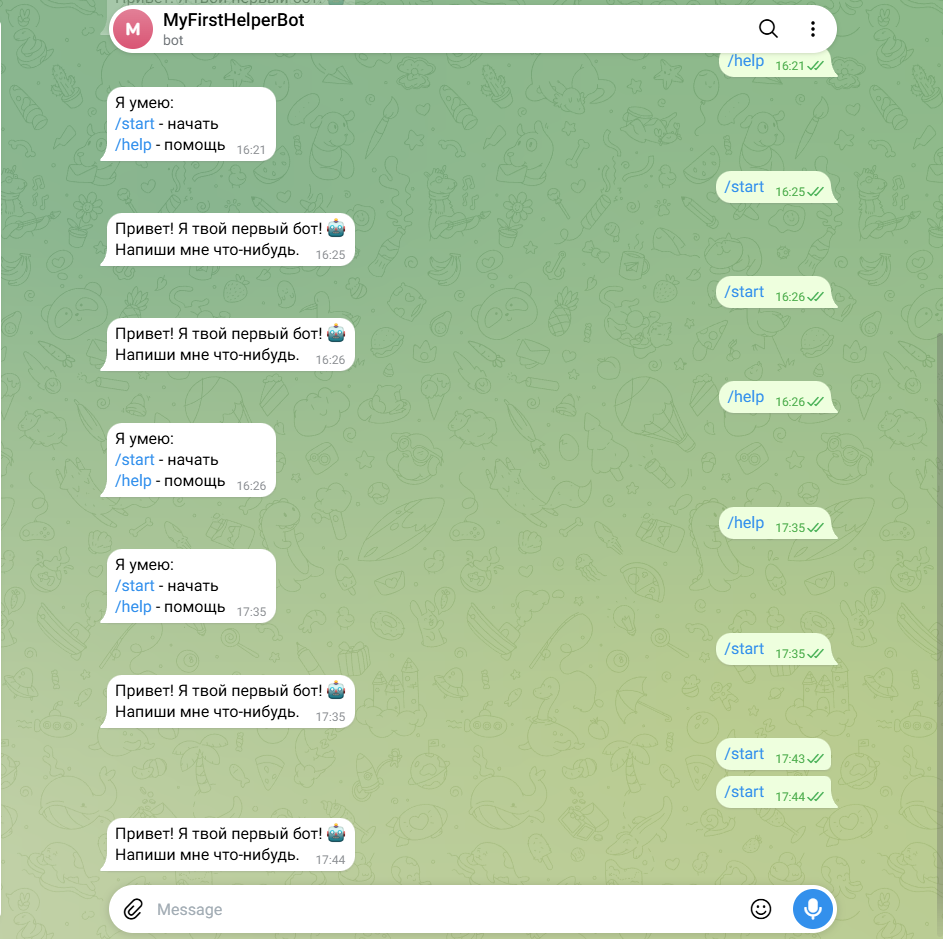

# Telegram-бот «Первый бот» 🤖

## Задача
Создать Telegram-бота, который отвечает на команды и повторяет сообщения пользователя.

## Решение
- Написал бота на Python с библиотекой python-telegram-bot
- Реализовал команды /start и /help, а также эхо-ответ на сообщения
- Развернул бота в облаке (PythonAnywhere), чтобы он работал 24/7
- Загрузил код на GitHub для хранения и демонстрации

## Результат
- Бот работает в облаке и отвечает пользователям
- Код доступен в открытом репозитории
- Освоил: Python, Telegram Bot API, работу с облаком, Git/GitHub

## Стек
Python, python-telegram-bot, PythonAnywhere, Git, GitHub

## Ссылка на код
https://github.com/progerman666/telegram-bot
## Скриншот работы бота

